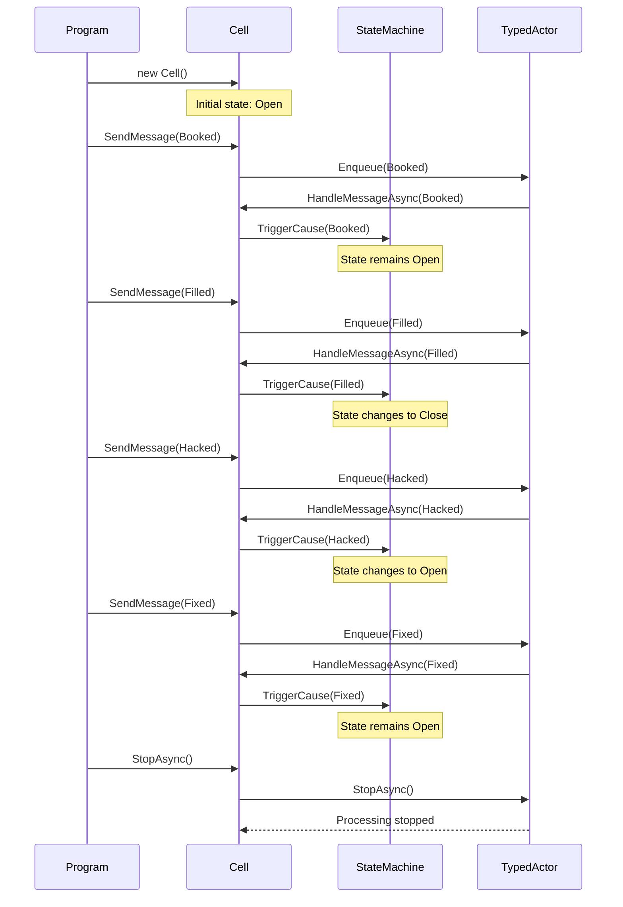

# StateSwitcher

StateSwitcher is a C# library that implements a flexible state machine pattern with actor model support. It provides a generic state machine implementation that can be used to manage state transitions in various applications.

## Features

- Generic state machine implementation that works with any enum-based states
- Actor model pattern for asynchronous message processing
- Support for state transitions with preconditions and actions
- Thread-safe message queueing and processing
- Easy-to-use API for defining and managing state transitions

## Core Components

### StateMachine
A generic state machine implementation that manages state transitions based on causes. It supports:
- Adding transitions between states
- Defining preconditions for transitions
- Specifying actions to perform during transitions
- Triggering state changes based on causes

### TypedActor
An abstract base class that implements the Actor model pattern with typed messages. It provides:
- Asynchronous message processing
- Thread-safe message queueing
- Automatic message handling
- Graceful shutdown support

### Cell
A concrete implementation of a state machine using the Actor model. It demonstrates:
- State transitions between Open and Close states
- Various transition causes (Empty, Filled, Booked, etc.)
- Precondition checking
- Action handling during transitions

## Usage Example

```csharp
// Create a new cell
Cell cell = new();

// Send messages to trigger state transitions
cell.SendMessage(CellStateTransitionCause.Booked);
cell.SendMessage(CellStateTransitionCause.Filled);
cell.SendMessage(CellStateTransitionCause.Hacked);
cell.SendMessage(CellStateTransitionCause.Fixed);

// Stop the cell's message processing
await cell.StopAsync();
```

## Sequence Diagram

The following diagram illustrates the flow of messages and state transitions in the example above:



## State Transitions

The Cell implementation supports the following state transitions:

### From Open State
- Filled → Close
- Booked → Open (self-transition)
- Fixed → Open (self-transition)

### From Close State
- Empty → Open
- Broken → Open
- Hacked → Open
- Polluted → Open

## Requirements

- .NET 6.0 or later
- C# 10.0 or later

## License

This project is licensed under the terms specified in the LICENSE file.